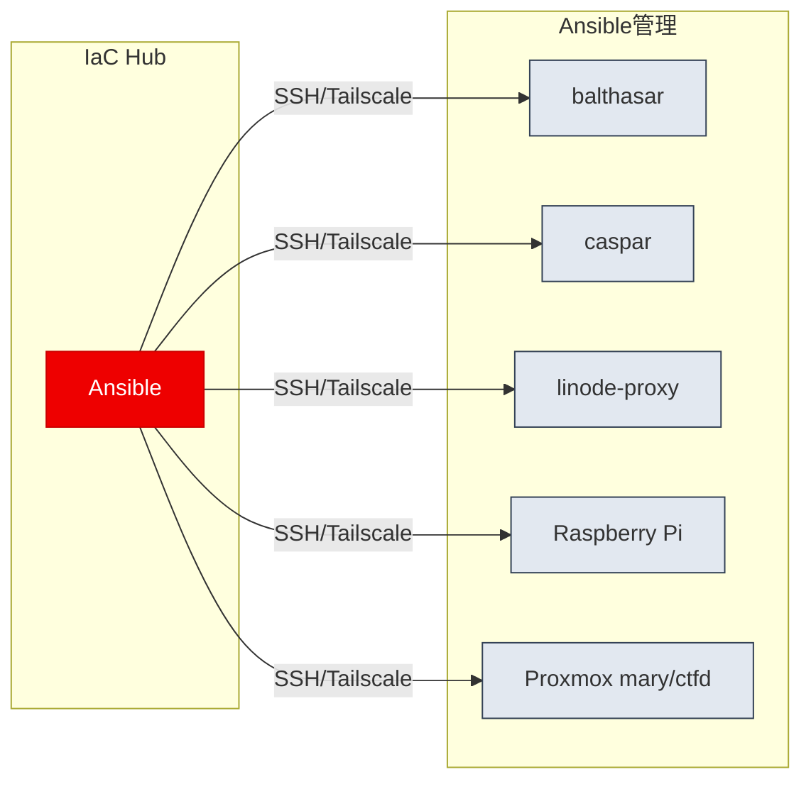

# yamisskey-provision

Linux server infrastructure management with Ansible and SOPS secrets management.

## Managed Servers

- **balthasar** - Production services (Misskey, Matrix, CryptPad)
- **caspar** - Monitoring & Auth (Prometheus, Grafana)
- **linode_prox** - External proxy (Squid, MediaProxy, Summaly)
- **raspberrypi** - Game server (Minecraft) - Raspberry Pi OS

## Infrastructure as Code



## System Requirements

- Linux distribution providing a writable `systemd`
- Python 3 available to install `ansible` via `uv`
- Go available to install `sops`, `age`, and `task`

## Prerequisites

### 1. Install Task (task runner)

```bash
go install github.com/go-task/task/v3/cmd/task@latest
```

Make sure `$GOPATH/bin` is in your PATH.

### 2. Install Tailscale

- [Download Tailscale](https://tailscale.com/download/linux)

### 3. Configure Tailscale SSH Access

Ensure servers can be reached in Tailscale:
```bash
tailscale login
sudo tailscale up --advertise-tags=tag:ssh-access --ssh --accept-dns=false --reset --accept-risk=lose-ssh
```

Verify you have access via Tailscale SSH:
```bash
tailscale ssh <hostname>
```

## Install

```bash
git clone https://github.com/yamisskey-dev/yamisskey-provision.git
cd yamisskey-provision
task install
task inventory
```

`ansible`, `sops`, and `age` will be installed.

## Usage

```bash
# Run a playbook
task run PLAYBOOK=misskey

# Check mode (dry-run)
task check PLAYBOOK=common

# List available playbooks
task list

# View help
task help
```

## Project Structure

```
yamisskey-provision/
├── playbooks/          # Ansible playbooks
├── group_vars/         # Group variables
├── host_vars/          # Host-specific variables
├── ansible_collections/
│   └── yamisskey/
│       └── servers/    # Custom roles and modules (yamisskey.servers collection)
├── inventory           # Server inventory (gitignored)
├── ansible.cfg         # Ansible configuration
└── Taskfile.yml        # Task runner configuration
```
